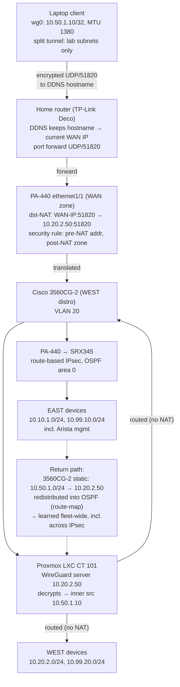

# Homelab Remote-Access VPN — WireGuard, Routed Design

Part of [CASEY-LAB](https://github.com/117caseyallen-NetAdm/casey-lab), a
dual-site multi-vendor homelab. The [hub](https://github.com/117caseyallen-NetAdm/casey-lab)
has the full topology; the [profile](https://github.com/117caseyallen-NetAdm)
indexes everything.

Remote-access VPN into a dual-site homelab, built with WireGuard in an unprivileged
Proxmox LXC behind a Palo Alto PA-440. VPN clients are **routed, not NATed**: the
client pool is redistributed into OSPF so every device across both sites, including
gear on the far side of a site-to-site IPsec tunnel, can reach clients by their real
tunnel IPs.

Multi-vendor path: WireGuard → TP-Link Deco → Palo Alto PAN-OS → Cisco IOS →
(IPsec) → Juniper Junos → Cisco IOS → Arista EOS

Full build sequence in [docs/build-notes.md](docs/build-notes.md); what went
wrong is in [docs/troubleshooting.md](docs/troubleshooting.md).

## Why this design

| Decision | Choice | Reason |
|---|---|---|
| VPN termination | WireGuard in LXC | GlobalProtect ruled out. The PA-440 is second-hand without an active support licence, so it cannot download the GP client package or receive content updates — and an internet-facing portal that cannot be patched is a real risk (CVE-2024-3400 class) |
| Client addressing | Routed pool `10.50.1.0/24`, no MASQUERADE | Per-client source IPs stay visible fleet-wide → real per-client firewall policy and clean logs |
| Return routing | Static route + OSPF redistribution (route-map filtered) | Far site learns the pool across the IPsec tunnel; no NAT hacks |
| MTU | 1380 on both ends | Inner traffic crosses a site-to-site IPsec tunnel (MTU 1400); default 1420 fragments or blackholes |
| Endpoint | DDNS hostname | Residential IP rotates eventually; clients re-resolve on reconnect |

## Packet flow



## Return path (the step everyone skips)

An inbound tunnel is useless if nothing can route back to the clients. The WireGuard
host is **not** the default gateway for any subnet, so replies to `10.50.1.x` would
otherwise follow the default route and die.

Fix, on the distribution switch fronting the WireGuard host:

```
ip route 10.50.1.0 255.255.255.0 10.20.2.50
ip prefix-list VPN-POOL seq 5 permit 10.50.1.0/24
route-map STATIC-TO-OSPF permit 10
 match ip address prefix-list VPN-POOL
router ospf 1
 redistribute static subnets route-map STATIC-TO-OSPF
```

The route-map matters: it redistributes *only* the VPN pool, not every static the
switch might ever carry. Verified as a Type-5 LSA in the LSDB and installed as
`O E2` on the far-site switch across the IPsec tunnel.

## Repo layout

```
configs/    sanitized configs for every hop (WireGuard, LXC, PAN-OS, IOS)
docs/       build notes + the debugging war stories
```

## The lesson worth the price of admission

PAN-OS evaluates security policy against the **pre-NAT destination address** but the
**post-NAT destination zone**. A dst-NAT security rule written with the post-NAT
address never matches — the packet dies on `interzone-default` with
`flow_policy_deny`, while the NAT rule's hit counter climbs happily. Details in
[docs/troubleshooting.md](docs/troubleshooting.md).

---

*All keys, public IPs, and hostnames in this repo are sanitized placeholders.
Internal RFC1918 addressing is real — that's the point.*
